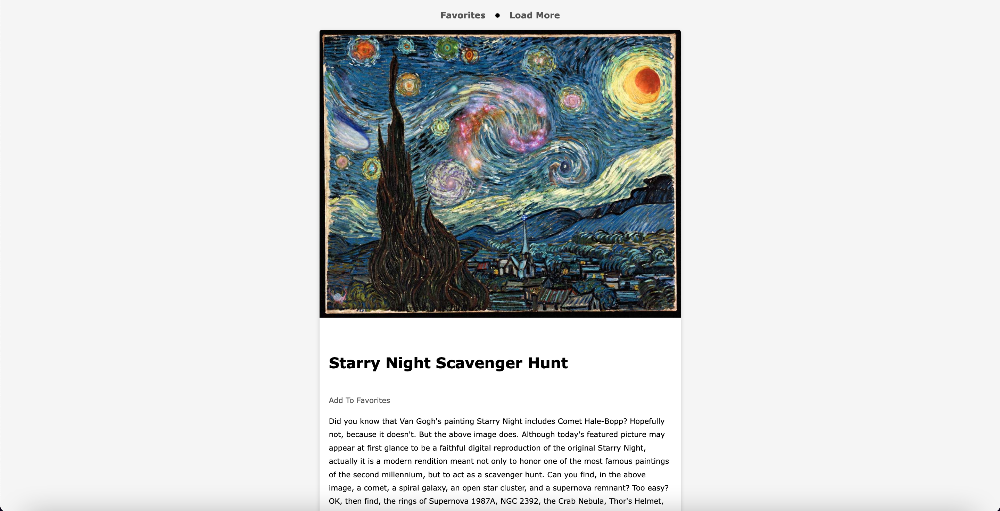
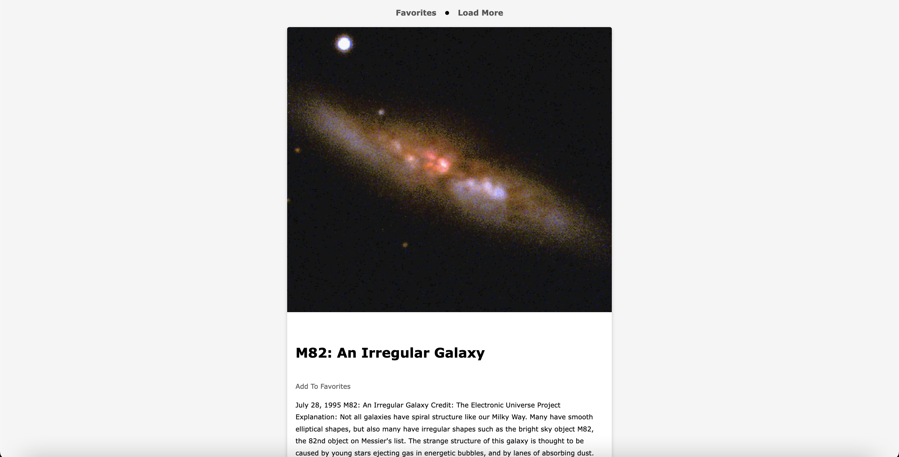

# Nasa-Api-Pics

## Purpose
Create an app that generates photos from a Nasa Api

# Description
An app that uses the NASA API to generate photos of the day with a description and the creator of the photo. You are able to save your favorite photos as well as delete them. You can load more photos at the click of a button.

## Built with
* JavaScript
* HTML
* CSS

# Preview Of Page

# Deployed Site
https://nasa-api-pics.vercel.app/